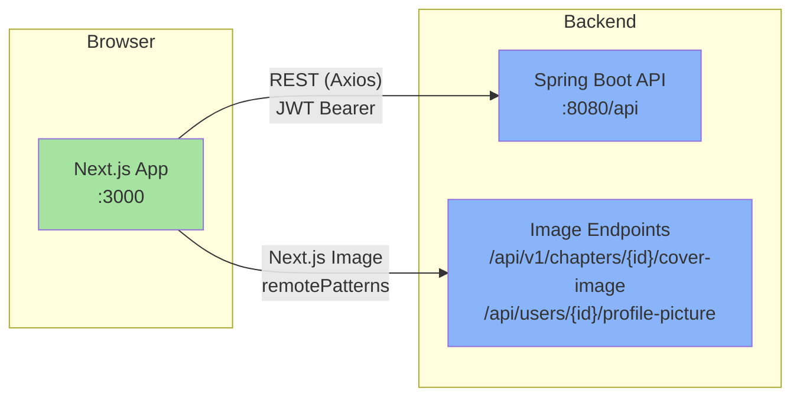
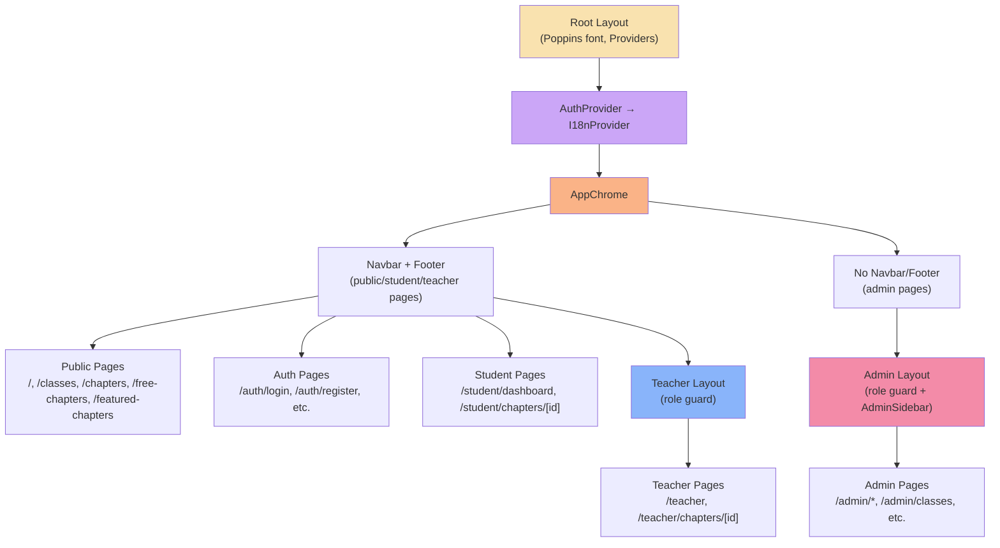
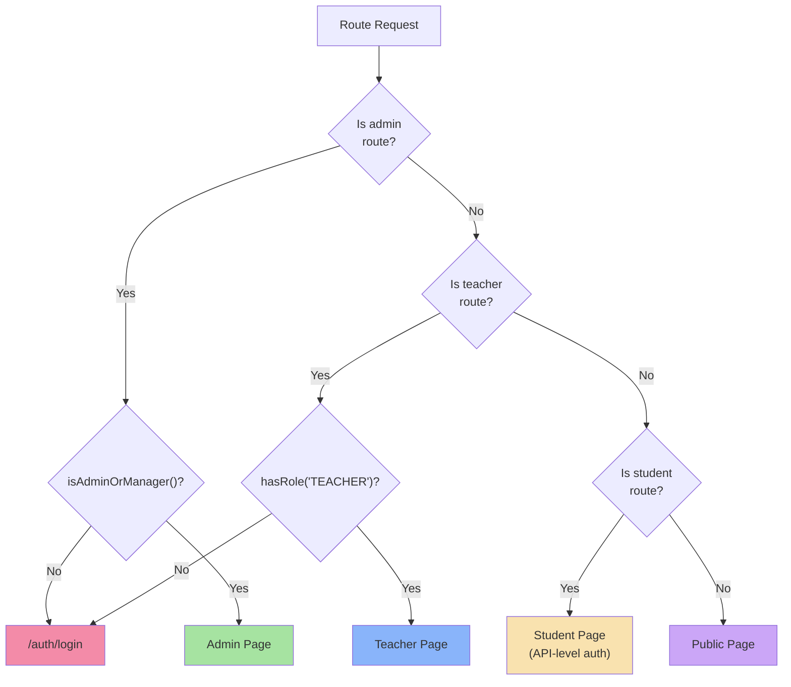
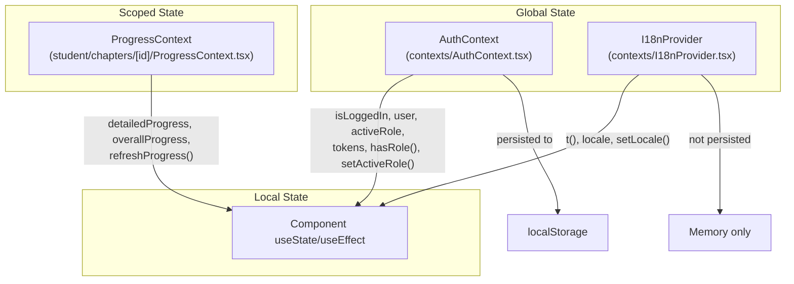
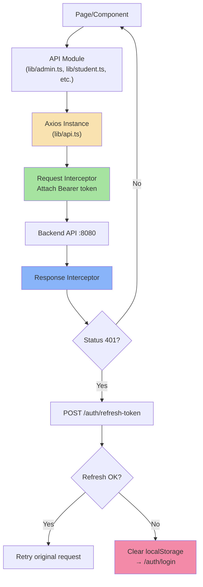
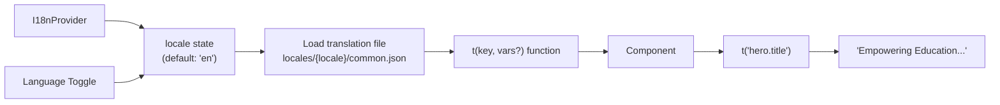
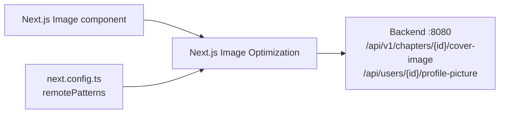

# Montola School — Frontend Architecture

> This document provides architectural context for AI coding assistants and developers onboarding to the project.

---

## System Context

The frontend is a **Next.js 16 App Router** application that communicates with a **Spring Boot REST API** backend:



---

## Application Layout Architecture



### Provider Hierarchy

```
<html>
  <body>
    <AuthProvider>              ← Auth state (tokens, user, roles)
      <I18nProvider>            ← Internationalization (en/bn)
        <NextTopLoader>         ← Orange progress bar on navigation
        <ToastContainer>        ← Toast notifications
        <AppChrome>             ← Conditional Navbar + Footer
          {children}            ← Page content
        </AppChrome>
      </I18nProvider>
    </AuthProvider>
  </body>
</html>
```

### AppChrome Logic

`AppChrome` conditionally wraps pages:
- **Admin routes** (`/admin/*`) → No Navbar or Footer (admin has its own `AdminSidebar`)
- **All other routes** → `Navbar` on top + `Footer` at bottom

---

## Routing Architecture

### Route Protection



**Protection mechanisms:**
- **Admin**: `AdminLayout` checks `isAdminOrManager()` from AuthContext
- **Teacher**: `TeacherLayout` checks `hasRole("TEACHER")` or admin/manager with teacher activeRole
- **Student**: No client-side guard — API returns 401/403 for unauthorized access
- **Public**: No protection

### Multi-Role Navigation

Users can have **multiple roles**. The `RoleToggle` component (admin sidebar) lets users switch their `activeRole`, which changes:
- Which dashboard they see
- Which sidebar links appear
- Which API calls are made

**Role priority**: `ADMIN > MANAGER > TEACHER > STUDENT`

On login, the highest priority role is auto-selected via `getHighestPriorityRole()` from `lib/roles.ts`.

---

## Component Architecture

### Component Categories

```mermaid
graph TD
    subgraph "UI Primitives (components/ui/)"
        BUTTON["Button"]
        INPUT["Input"]
        SELECT["Select"]
        MODAL["Modal"]
        TABLE["DataTable"]
    end

    subgraph "Shared Components (components/shared/)"
        PROFILE["ProfileContent<br/>(avatar + password)"]
    end

    subgraph "Layout Components"
        NAVBAR["Navbar"]
        FOOTER["Footer"]
        SIDEBAR["AdminSidebar"]
        COURSE_SIDEBAR["CourseSidebar"]
    end

    subgraph "Landing Components"
        HERO["Hero"]
        FEATURED["FeaturedCourses"]
        FREE["FreeChapterList"]
        CLASSES["ClassesListSection"]
        VALUES["ValueProps"]
    end

    subgraph "Admin Components (components/admin/)"
        CLASS_FORM["ClassForm"]
        SUBJECT_FORM["SubjectForm"]
        CHAPTER_FORM["ChapterForm"]
        STATUS["StatusToggle"]
        TEACHER_ASSIGN["TeacherAssignment"]
        PAY_VERIFY["PaymentVerification"]
        ROLE_TOGGLE["RoleToggle"]
    end

    subgraph "Teacher Components (components/teacher/)"
        TREE["ChapterTreeView"]
        TOPIC_FORM["TopicForm"]
        LECTURE_FORM["LectureForm"]
        PDF_FORM["PdfForm"]
        QUIZ_FORM["QuizForm"]
        CONTENT_FORM["ContentForm"]
        ASSIGNED["AssignedChaptersList"]
    end

    subgraph "Student Components (components/student/)"
        PAY_MODAL["PaymentModal"]
    end

    ADMIN_PAGE2["Admin Pages"] --> CLASS_FORM & SUBJECT_FORM & CHAPTER_FORM & STATUS & TEACHER_ASSIGN & PAY_VERIFY & ROLE_TOGGLE
    TEACHER_PAGE2["Teacher Pages"] --> TREE & TOPIC_FORM & LECTURE_FORM & PDF_FORM & QUIZ_FORM & ASSIGNED
    STUDENT_PAGE2["Student Pages"] --> COURSE_SIDEBAR & PAY_MODAL
    ALL["All Pages"] --> BUTTON & INPUT & SELECT & MODAL & TABLE

    style QUIZ_FORM fill:#f38ba8
    style TREE fill:#f38ba8
    style COURSE_SIDEBAR fill:#f38ba8
```



### Largest Components (by complexity)

| Component | File Size | Complexity |
|-----------|-----------|------------|
| Content Player (`student/chapters/[id]/content/[contentId]/page.tsx`) | 44KB | Handles lectures (video + text), quizzes (4 types with scoring), PDFs (Google Docs viewer), sequential access enforcement |
| QuizForm (`components/teacher/QuizForm.tsx`) | 32KB | Full quiz builder with 4 question types: MCQ, fill-in-blank, table matching, written |
| Chapter Detail (`admin/chapters/[id]/page.tsx`) | 25KB | Full chapter management with structure view, teacher assignment, status toggle, cover image |
| Public Chapter (`chapters/[id]/page.tsx`) | 24KB | Chapter preview with enrollment/payment flow, structure tree |
| Navbar (`components/Navbar.tsx`) | 19KB | Role-aware navigation, mobile responsive, language switcher |
| ProfileContent (`components/shared/ProfileContent.tsx`) | 16KB | Avatar upload, password change, personal info display |
| ChapterTreeView (`components/teacher/ChapterTreeView.tsx`) | 16KB | Hierarchical topic/content editor with drag-and-drop-like CRUD |
| CourseSidebar (`components/CourseSidebar.tsx`) | 13KB | Student navigation through chapter structure with progress indicators |

---

## State Management Architecture



### AuthContext State Shape

```typescript
{
  isLoggedIn: boolean;
  isLoading: boolean;
  accessToken: string | null;
  refreshToken: string | null;
  user: User | null;
  activeRole: string | null;    // Currently active role (for multi-role users)
}
```

**Persistence**: `accessToken`, `refreshToken`, `user`, `activeRole` are stored in `localStorage` and restored on mount.

---

## API Integration Architecture



### API Module Organization

| Module | Role Scope | Key Endpoints |
|--------|-----------|---------------|
| `auth.ts` | Public/Any | Login, register, activate, password reset |
| `admin.ts` | ADMIN/MANAGER | CRUD for classes, subjects, chapters, users, payments |
| `teacher.ts` | TEACHER | Assigned chapters, topic/content CRUD |
| `student.ts` | STUDENT | Progress, content viewing, enrollment, payment |
| `public.ts` | Public | Featured/free chapters, public structures |
| `user.ts` | Any | Profile picture, user by email |

---

## Content Player Architecture

The content player (`student/chapters/[id]/content/[contentId]/page.tsx`) is the largest and most complex page. It handles 3 content types:

```mermaid
stateDiagram-v2
    [*] --> LoadContent: GET /contents/{id}
    LoadContent --> CheckType

    CheckType --> LectureView: type === LECTURE
    CheckType --> QuizView: type === QUIZ
    CheckType --> PdfView: type === PDF

    LectureView --> VideoPlayer: Has videoId
    LectureView --> RichText: Has text content
    VideoPlayer --> MarkComplete
    RichText --> MarkComplete

    QuizView --> MCQ: quizType === MCQ
    QuizView --> FillBlank: quizType === FILL_BLANK
    QuizView --> Matching: quizType === TABLE_MATCHING
    QuizView --> Written: quizType === WRITTEN
    MCQ --> SubmitQuiz
    FillBlank --> SubmitQuiz
    Matching --> SubmitQuiz
    Written --> SubmitQuiz
    SubmitQuiz --> ShowScore
    ShowScore --> MarkComplete

    PdfView --> GoogleDocsViewer: Embed via iframe
    GoogleDocsViewer --> MarkComplete

    MarkComplete --> POST_COMPLETE["POST /progress/content/{id}/complete"]
    POST_COMPLETE --> NavigateNext["Navigate to next content"]
```

**Sequential access**: Content must be completed in order. If a student tries to access content out of order, the API returns 403 and the frontend shows an error.

---

## Internationalization Architecture



**Key details:**
- 2 languages: English (`en`) and Bengali (`bn`)
- Dot-notation keys: `t('nav.dashboard')`, `t('auth.login.title')`
- Variable interpolation: `t('welcome', { name })` → `"Welcome, {{name}}"` → `"Welcome, Avi"`
- Translation files: `src/locales/{en,bn}/common.json`
- Language not persisted across sessions (resets to `en` on page reload)

---

## Styling System

| Aspect | Detail |
|--------|--------|
| Framework | Tailwind CSS 3.4 |
| PostCSS | Autoprefixer |
| Font | Poppins (Google Fonts, `next/font`) |
| Theme | Custom green primary (50–900) |
| Approach | Utility classes in JSX |
| Responsive | Mobile-first (`md:`, `lg:` breakpoints) |

### Custom Theme Colors

```
primary-50:  #e6f4ea    (background, hover states)
primary-100: #c0e4c6
primary-200: #97d7a0
primary-300: #6fc97b
primary-400: #4ab95c
primary-500: #2ca83e    ← Brand green (buttons, links)
primary-600: #228a33    ← Dark variant (hover states)
primary-700: #196b27
primary-800: #0f4c1b
primary-900: #07300f    (text on light backgrounds)
accent:      #ffffff    (white)
```

---

## Image Handling

Images are served from the backend and proxied through Next.js:



Configuration in `next.config.ts`:
- Protocol: `NEXT_PUBLIC_API_IMAGES_PROTOCOL` (default: `http`)
- Hostname: `NEXT_PUBLIC_API_IMAGES_HOSTNAME` (default: `localhost`)
- Port: `NEXT_PUBLIC_API_IMAGES_PORT` (default: `8080`)
- Path pattern: `/api/**`
